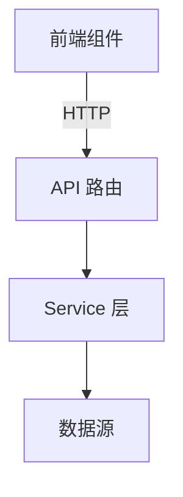

# Version Plan: vX.Y.Z

> 创建日期: YYYY-MM-DD | 前一版本: vX.Y.Z | 状态: 🔄 规划中

## 一、版本目标

用一段话描述这个版本要交付的核心价值。

## 二、技术选型

### 2.1 新增依赖

| 库 | 版本 | 用途 | 选型理由 |
|----|------|------|----------|
| | | | |

### 2.2 候选方案对比

每个技术决策需列 2-3 个候选方案并说明取舍：

**决策: [功能名称]**
| 方案 | 优点 | 缺点 | 结论 |
|------|------|------|------|
| A | | | |
| B | | | ✅ 选用 |
| C | | | |

## 三、架构设计

### 3.1 新增/修改的模块

```
backend/app/
├── new_module/        # [新增] 模块描述
│   ├── __init__.py
│   ├── service.py     # 核心逻辑
│   └── ...
├── existing_module/   # [修改] 变更说明
```

### 3.2 数据流



### 3.3 数据库变更

列出需要新增或修改的 ORM 模型，标记是否需要 Alembic 迁移。

## 四、组件拆解

### Phase N: [阶段名称]

每个 Issue 拆分为 2-4 小时可完成的工作量：

#### Issue N.1: [标题] (类型, 优先级, 依赖)
- **描述**: 做什么
- **文件范围**: 列出涉及的文件
- **验收**: 3-5 个可验证的检查项
- **测试要求**: 单元测试 / 集成测试 / E2E
- **依赖**: 在哪些 Issue 完成之后才能开始

#### Issue N.2: ...

## 五、风险与回滚

- 潜在风险及缓解措施
- 如果功能有问题，如何回滚

## 六、里程碑

| 里程碑 | Phase | 预计 Issue 数 | 验收标准 |
|--------|-------|--------------|----------|
| | | | |
